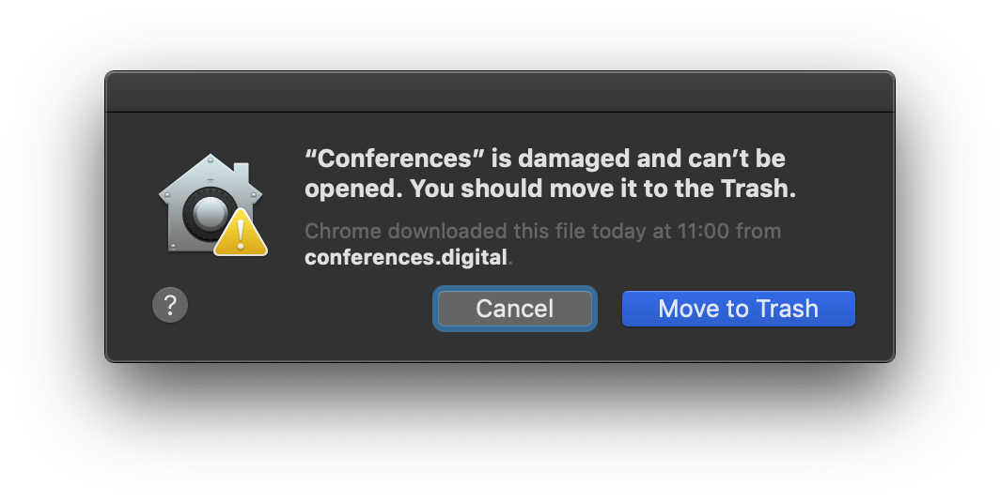
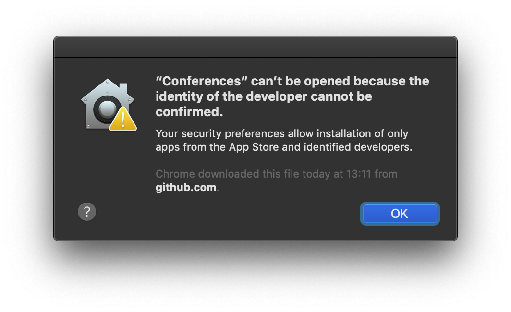

    

    
    

**Conferences.digital** is the best way to watch the latest and greatest videos from your favourite developer conferences for free on your Mac. Either search specifically for conferences, talks, speakers or topics or simply browse through the catalog - you can add talks to your watchlist to save for later, favourite or continue watching where you left off.

As soon as new conferences/talks have been added it will be announced on [twitter](https://twitter.com/zagahr).

**Download the latest release [here](https://github.com/zagahr/Conferences.digital/releases/download/0.0.1-alpha20/Conferences_v0.0.1-alpha20.zip).**

 

### Just one second of your time

I am a junior iOS developer currently looking for opportunities to start my career in London/Dublin/SF. I'd be very grateful for any help/hints/tips you might have 🙂

 

## Overview

    </a>

## Features
- [x] Search
- [x] Updates via Sparkle 
- [x] Watchlist 
- [x] Continue watching / Track progress
- [ ] Touch Bar support

 

## iOS app

I was approached by a number of people asking if and whether an iOS version was available. Although I had designed the app thinking that the demand for a macOS app was greater than for an iOS app, I saw the opportunity to develop this project further and am currently in the progress of writing the iOS version.

The repository of the iOS app can be found [here.](https://github.com/zagahr/Conferences-for-iOS)

    </a>

 

## Installation
Some of you will see the warning in the screenshot below about the app "can't be opened because it is from an unidentified developer" when you first try to run it.

    
    

This is because I am not registered with Apple as part of their developer program. This is the first MacOS app that I've ever built, and I don't plan to release it in the Mac App Store so I don't want to pay the fees to register with Apple.

To bypass Apple's restriction, right-click the app and select **"Open"** the first time you use it or open your System Preferences application, click on the Security & Privacy selection, and there will be an **"Open Anyway"** button you can click.

If you have any other issues check out [#9](https://github.com/zagahr/Conferences.digital/issues/9).

 

## Contributing

[Join the chat on Slack](https://join.slack.com/t/conferencesdigital/shared_invite/enQtNTc3MjEyNzE0NTYxLTU2NTgxOTI3YjBlN2JkZTA2ODAxMTQ0OWJlMDhmMjZmZWMzNTA1OTM3YjQ3YzRkZjZhZGEzNzdhN2M2ZjAxNDI)

If you have any ideas how to improve the app or you wish yourself a new feature you can submit an pull request or create an issue [here](https://github.com/zagahr/Conferences.digital/issues).

If you want to submit an pull request make sure you read the [contribution guidelines](CONTRIBUTING.md) first.

 

## Bugs
Please be advised that this project is still in an early stage and work in progress.

If you encounter any bugs please create an issue [here](https://github.com/zagahr/Conferences.digital/issues) and be as descriptive as possible.

 

## Requirements
**Conferences.digital** is written in Swift 5. Compatible with macOS 10.12.2+  

 

## Author
Timon Blask - [@zagahr](https://twitter.com/zagahr)

 

## License
**Conferences.digital** is available under the BSD-2-Clause license.
